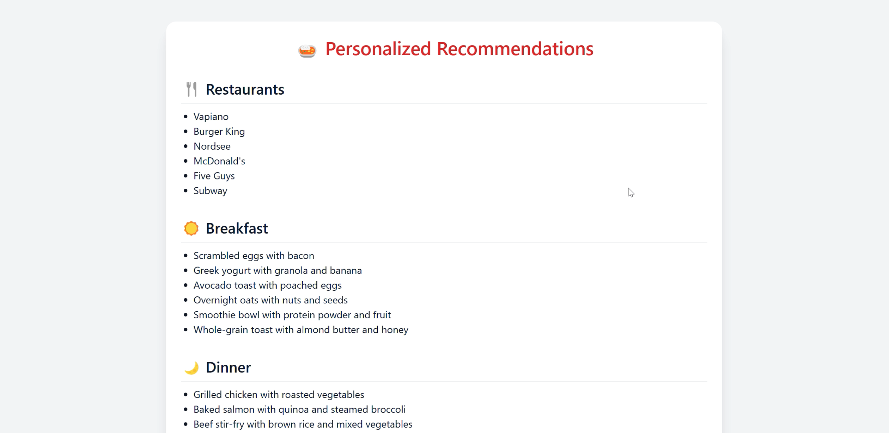

# NutriNavigator: AI-Powered Diet & Wellness Recommendations

[](https://www.youtube.com/watch?v=AuEiaExjJVY)


## 🍏 Overview

NutriNavigator is an AI-powered web application that provides personalized diet plans, restaurant recommendations, and workout suggestions based on individual health profiles and preferences. The system uses advanced language models to generate tailored recommendations for optimal health and wellness.

## ✨ Features

- **Personalized Diet Plans**: Get customized breakfast and dinner recommendations
- **Restaurant Suggestions**: Discover nearby restaurants matching your dietary needs
- **Workout Routines**: Receive exercise recommendations based on your profile
- **Health Considerations**: Accounts for allergies, diseases, and dietary restrictions
- **Regional Preferences**: Provides culturally appropriate food suggestions

## 🛠️ Technologies Used

- **Frontend**: HTML, Tailwind CSS
- **Backend**: Python, Flask
- **AI**: LangChain, Groq API (Llama 3.3 70B model)
- **Deployment**: (Specify if deployed, e.g., Render, Vercel, etc.)

## 🚀 Getting Started

### Prerequisites

- Python 3.7+
- pip package manager
- Groq API key (free tier available)

### Installation
1. Clone the repository: 
   ```bash
   git clone https://github.com/yourusername/NutriNavigator.git
   cd NutriNavigator
   ```
2. Create a virtual environment:
   ```bash
   python -m venv venv
   source venv/bin/activate  # On Windows: venv\Scripts\activate
   ```
3. Install dependencies:
    ```bash
    pip install -r requirements.txt
    ```
4. Set up your environment variables:
    ```bash
    echo "GROQ_API_KEY=your_api_key_here" > .env
    ```

     ## 🔗 Additional Resources
- **linkden**: [Karim Farjam's Profile](https://www.linkedin.com/in/karim-farjam-a6b72549/).
- **Kaggle Notebook**: Interested in a Kaggle environment? Check out the notebook [here](https://www.kaggle.com/parhamfarjam).
- **LinkedIn**: [Karim Farjam's Profile](https://www.linkedin.com/in/karim-farjam-a6b72549/)

    
Running the Application
Start the Flask development server:
  ```bash
   python app.py
  ```
